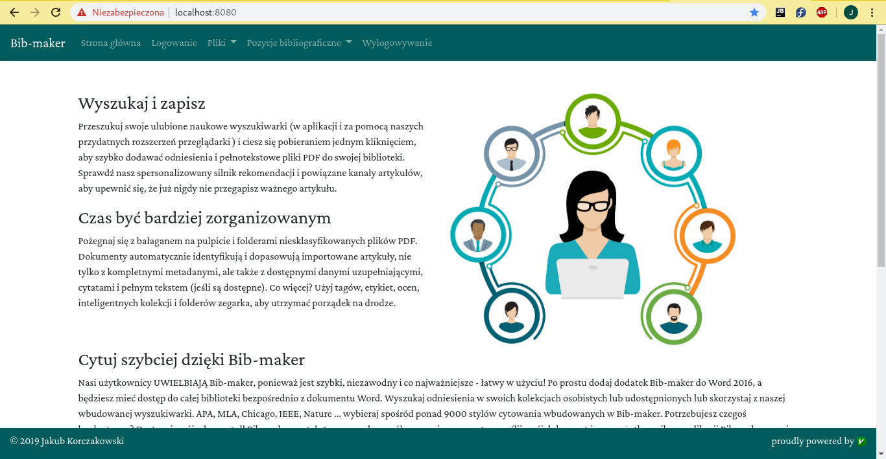
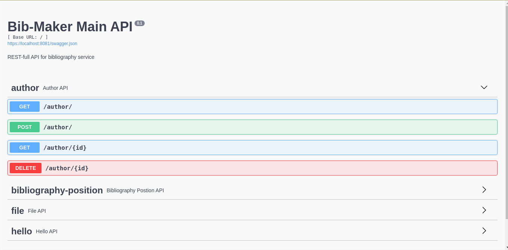

# Aplikacja webowa do obsługi bibliografii

Projekt zrealizowany w trakcie przedmiotu **Programowanie Aplikacji Mobilnych i Webowych**.

## Spis treści

- [Cel projektu](#cel-projektu)
- [Opis projektu](#opis-projektu)
- [Uruchomienie aplikacji](#uruchomienie-aplikacji)
- [Funkcjonalność](#funkcjonalno)
- [Etapy tworzenia projektu](#etapy-tworzenia-projektu)
    - [Etap 1 - Formularz rejestracyjny](#etap-1---formularz-rejestracyjny)
    - [Etap 2 - Logowanie i przechowywanie plików](#etap-2---logowanie-i-przechowywanie-plikw)
    - [Etap 3 - Publikacje, RESTFull i klient mobilny](#etap-3---publikacje-restfull-i-klient-mobilny)
    - [Etap 4](#etap-4)
- [Rozwój projektu](#rozwj-projektu)

## Cel projektu

Stworzenie aplikacji do zarządzania źródłami w pracach naukowych.

## Opis projektu

Aplikacja napisana jest w języku **Python** z użyciem bibliioteki **Flask**. Wykorzystywana jest również baza danych **Redis**. Całość aplikacji uruchamiana jest za pomocą **Dockera**. Aplikacja wykorzystuje **Bootsrapa** w celu dostosowania wyglądu na urządzenia mobilne. Logowanie zrealizowane jest za pomocą protokołu **OAuth 2.0**.

## Funkcjonalność

Aplikacja służy do zarządzania źródłami w pracach naukowych.

Projekt składa się z dwóch głównych modułów zdefiniowanych w pliku ``docker-compose.yml``:
+ ``web-front`` - moduł odpowiada za obsługę komunikacji z użytkownikiem. Służy do obsługi logowania poprzez serwis ``auth0.com`` oraz do komunikacji z modułem ``web-files``.
+ ``web-files`` - moduł zrealizowany jako usługa sieciowa typu **RESTFull API** obsługujący zapis w bazie danych publikacji oraz plików z nimi powiązanych.

Aplikacja pozwala na:
+ dodawanie pozycji bibliograficznej,
+ listowanie pozycji bibliograficznych,
+ usuwaniu pozycji bibliograficznych,
+ podpinanie i odpinanie plików przy pozycji bibliograficznej,
+ dodawanie, pobieranie i usuwanie plików.

Komunikacja może zostać zrealizowana poprzez aplikację kliencką znajdująca się domyślnie pod adresem: https://localhost:8080 oraz REST API znajdujące się pod adresem: https://localhost:8081.



Działająca aplikacja.

API posiada dokumentację w platformie **Swagger** znajdującą się pod adresem: https://localhost:8081. 



Dokumentacja **REST API** w plaformie **Swagger**.

## Uruchomienie aplikacji

Aplikację można uruchomić za pomocą **Dockera**.

Przed uruchomieniem należy utworzyć plik **.env** w katalogu głównym repozytorium. W pliku należu zdefiniować zmienną **FLASK_SECRET**.

Należy również zadbać o własną konfiguraję ``auth0.com``. Należy uwzględnić zmienną **OAUTH_CLIENT_SECRET**, którą należy zdefiniować w pliku **.env** oraz zmienne w pliku [const_config.py](./front_app/const_config.py).

Projekt można uruchomić używając w katalogu głównym repozytorium polecenia:

```bash
docker-compose up --build
```

## Etapy tworzenia projektu

### Etap 1 - Formularz rejestracyjny

Opracowanie formularza rejestracyjnego dla nowych użytkowników. Formularz musi pozwalać na **walidowanie wszystkich pól na bieżąco**. Kod JavaScript, HTML i CSS muszą być od siebie **odseparowane**. Komunikaty błędów muszą być tworzone dynamicznie przez kod JS. Polę login użytkownika będzie sprawdzane pod kątem dostępności **asynchronicznie**. Dane do rejestracji będą przesyłane do na zewnętrzny serwer. Kod HTML i CSS musi przechodzić walidację.

### Etap 2 - Logowanie i przechowywanie plików

Opracowanie modułu służącego do bezpiecznego logowania i wylogowywania użytkownika. Moduł logowania otrzymuje od użytkownika hasło i login – w przypadku poprawnych danych generowany jest **identyfikator sesji**. Dane sesyjne przechowywane są w bazie danych **Redis**. Należy opracować formularz pozwalający na przechowywanie przez użytkownika plików **PDF** w systemie. Pliki PDF powinny być dostępne do pobrania i serwowane przez **bezstanową aplikację**. Należy wykorzystać **JWT** z krótką datą ważności.

### Etap 3 - Publikacje, RESTFull i klient mobilny

Celem etapu jest przygotowanie usługi sieciowej pozwalającej na przechowywanie i modyfikację pozycji bibliograficznych. Usługa sieciowa powinna zwracać powiązane elementy zgodnie z **HATEOAS**.  
Aplikacja kliencka ma zostać dostosowana do użycia mobilnego. Można w tym celu wykorzystać **Bootstrapa**.

Projekt w stanie bezpośrednio po tym etapie można znaleźć w zakładce [release](https://github.com/jakubkorczakowski/bibliography-web-app/releases/tag/v1.0).

### Etap 4

Celem etapu jest zintegrowanie logowania do aplikacji z wykorzystaniem **OAuth2.0**. Najlepiej wykorzystać auth0.com.

Projekt w stanie bezpośrednio po tym etapie można znaleźć w zakładce [release](https://github.com/jakubkorczakowski/bibliography-web-app/releases/tag/v2.0).

## Rozwój projektu:
+ Zmiana bazy danych na SQL (np. PostgreSQL),
